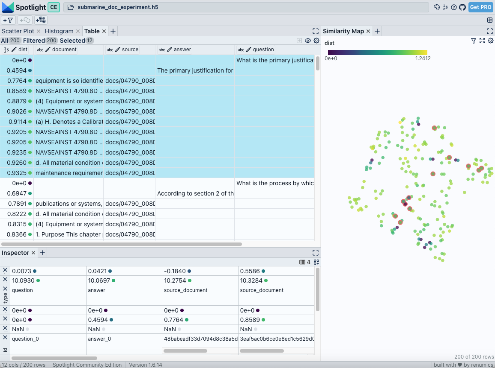
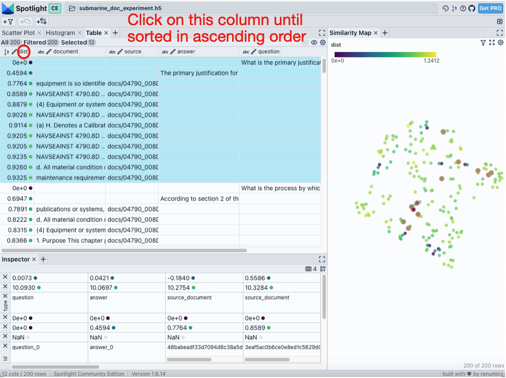

# visualize-rag

This project allows you to load documents from a specified directory, create embeddings for these documents, store them in a vector database, and use a language model to answer questions about the documents. The results are then visualized using Spotlight.

## Features

- Load documents from a directory (supports PDF files).
- Create embeddings using OpenAI or Ollama models.
- Store document embeddings in a Chroma vector database.
- Ask questions and get answers using OpenAI or Ollama models.
- Visualize the documents and answers using Spotlight.

## Installation

### Prerequisites

- Python 3.10 or higher
- Pip (Python package installer)
- Windows 10 or later / macOS 11 Big Sur or later

### Virtual Environment

Create a virtual environment to containerize all requirements and avoid dependency conflicts

```sh
conda create --name visualize_rag_env python=3.10
```

### Dependencies

Install the required dependencies using pip:

```sh
pip install -r requirements.txt
```

## Usage

### Command Line Arguments

- `--docs_dir` (required): Directory of documents to load (required).
- `--vectorstore_dir` (required): Directory to store the vector database (required).
- `--embeddings_model` (required): Model for embeddings (e.g., `openai:text-embedding-ada-002` or `ollama:mistral`) (required).
- `--llm_model` (required): LLM model for QA (e.g., `openai:gpt-4` or `ollama:mistral`) (required).
- `--h5_name` (optional): Base name for the HDF5 file (without .h5). If omitted, a timestamped name docs_store_YYYYMMDD_HHMMSS.h5 is generated.

### Running the Script

To run the script, use the following command:

```sh
python3 visualize_rag.py --docs_dir ./documents --vectorstore_dir ./vectorstore --embeddings_model openai:text-embedding-ada-002 --llm_model openai:gpt-4 --h5_name visualization_experiment_with_doc_1
```

For open source models, use the following command:

```sh
python3 visualize_rag.py --docs_dir ./documents --vectorstore_dir ./vectorstore --embeddings_model ollama:mistral --llm_model ollama:mistral --h5_name visualization_experiment_with_doc_1
```

### Interactive Question-Answer Session

After running the script, you will be prompted to enter your questions. Type your question and press Enter to get an answer. To finish the session, type `done`.

### RAGAS Evaluation

After the interactive question-answer session, the script proceeds with RAGAS evaluation.

The following RAGAS metrics are calculated for each question-answer pair:

-   **Faithfulness:** Measures the factual consistency of the generated answer with the provided context. A higher score indicates that the answer is more grounded in the retrieved documents.
-   **Answer Relevancy:** Assesses how relevant the generated answer is to the given question. A higher score means the answer directly addresses the user's query.
-   **Context Precision:** Evaluates how relevant the retrieved context is to the question. A higher score indicates that the retrieved documents are highly focused on the query.
-   **Context Recall:** Measures the extent to which all the necessary information to answer the question is present in the retrieved context. This metric **requires ground truth answers** for calculation.

**Ground Truth Answers:**
The script will prompt you to provide ground truth answers for the questions you asked. You have two options:
1.  **Enter ground truth answers manually:** This will enable the calculation of `Context Recall`.
2.  **Skip ground truth:** If you choose to skip, `Context Recall` will not be computed for the evaluation, and its column in the results will show `None`.

**Evaluation Results:**
The RAGAS evaluation results for each metric are added as new columns to the generated Spotlight dataset. Additionally, a CSV file named `ragas_evaluation.csv` will be saved in your current working directory, containing a summary of the RAGAS scores alongside your questions, answers, and contexts.

### Visualization

Once you finish the question-answer session and RAGAS evaluation is complete, the script will launch the Spotlight viewer.



The Spotlight visualization will contain the following key columns for analysis:

-   `id`: Unique identifier for each entry (question, answer, or document chunk).
-   `question`: The question asked by the user (populated only for question rows).
-   `answer`: The answer generated by the LLM (populated only for answer rows).
-   `source`: The source file of the document chunk.
-   `page`: The page number within the source document.
-   `document`: The content of the document chunk.
-   `embedding`: The high-dimensional embedding vector of the content.
-   `dist`: The Euclidean distance of the embedding to the question's embedding. This helps in understanding the semantic similarity.
-   `query_id`: An identifier to group questions, their answers, and their relevant source documents.
-   `type`: Categorizes the row as 'question', 'answer', 'source_document', or 'document', aiding in organized display.
-   `x`, `y`: 2D UMAP coordinates for visualizing embeddings in a 2D space.

You can use the sorting and filtering features in Spotlight to analyze the RAG pipeline's performance. You can use the “visible column” button to select the columns “question”, “answer”, “source”, “document”, and “dist”. 


Ordering the table by “dist” (click on the "dist" column name) shows the question, answer, and the most relevant document snippets on top. Select the rows to highlight them in the similarity map on the top right.



## Reload Visualization: launch_visualization.py
Use this helper script to load a previously saved .h5 dataset without rebuilding embeddings or re-running QA.

### Command Line Arguments
- `--h5_path` (required): Path to the saved HDF5 dataset (e.g., vectorstore/visualization_datastore/docs_store_20250619_103045.h5).

To run the script, use the following command:
```sh
python3 launch_visualization.py --h5_path ./vectorstore/visualization_datastore/my_docs_snapshot.h5
```
This will spin up Spotlight immediately on the saved dataset.

## Additional Information

### OpenAI API Key

If you choose to use OpenAI models for embeddings or the LLM, you will be prompted to enter your OpenAI API key.

### Ollama Installation

If you choose to use Ollama models and Ollama is not installed on your system, the script will prompt you to download and install it. Follow the on-screen instructions to complete the installation. If for some reason installation does not work, do the following steps to get Ollama running on your local machine.

- Go to ollama.com/download and install Ollama
- Once Ollama is installed, run the following command to download a open-source model: `ollama pull model_name (mistral, llama3, etc)`
- Once your models are downloaded, you can check if they are installed by running `ollama list`
- Finally, you can simply run `ollama serve` to launch an Ollama server
- To run the open source script command, you must install Mistral (`ollama pull mistral`) and Nomic embeddings (`ollama pull nomic-embed-text`)

## License

This project is licensed under the MIT License. See the LICENSE file for details.
